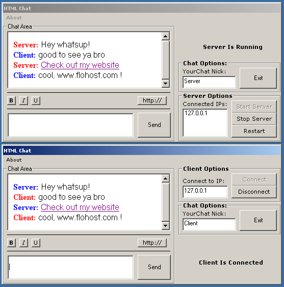



## HTML Messenger

### Description

HTML Chat is a program that you can chat with

other people and have it show up in HTML instead

of regular text or richtext. If you have used

AIM (AOL Instant Messenger) you will know what

I am talking about. AIM uses HTML for chatting.

Use this program however you want, you can use

it as an example or you can use it in one of

your programs as it is. I really do not mind,

all that I ask is for your comments. I put a bit

of time into this and I thought it would be a

great help to people wanting to make their own

chat program.

I may upload a new version that has emoticons,

it is not hard at all to add those. Thank you

for taking the time to download my software.
 
### More Info
 

             |
---                |---
**Submitted On**   |2002-10-12 07:55:42
**By**             |[Travis Rowland](https://github.com/Planet-Source-Code/PSCIndex/blob/master/ByAuthor/travis-rowland.md)
**Level**          |Beginner
**User Rating**    |4.7 (14 globes from 3 users)
**Compatibility**  |VB 5\.0, VB 6\.0
**Category**       |[Internet/ HTML](https://github.com/Planet-Source-Code/PSCIndex/blob/master/ByCategory/internet-html__1-34.md)
**World**          |[Visual Basic](https://github.com/Planet-Source-Code/PSCIndex/blob/master/ByWorld/visual-basic.md)
**Archive File**   |[HTML\_Messe14504810122002\.zip](https://github.com/Planet-Source-Code/travis-rowland-html-messenger__1-39753/archive/master.zip)

